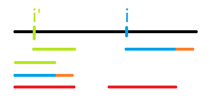
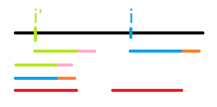

## 引入

先来看几个问题：

> 什么是 Z 算法呢？

Z 算法（Z-Algorithm，又叫拓展 KMP 或 exKMP）是一种字符串匹配算法，可以在 $O(n)$ 时间内算出一些关于字符串匹配的问题。

> 为什么要用 Z 算法？

暴力进行匹配是 $O(n^2)$ 的，但用 Z 后是 $O(n)$ 的（KMP 也可以实现类似的功能）。

接下来是一些约定：

> 1. $s[l .. r]$ 表示 $s_ls_{l + 1}s_{l + 2} ... s_r$
> 2. z 函数用 $z()$ 表示，原字符串用 $s$ 表示
> 3. 下标从 $1$ 开始

## 算法流程

### 定义

**定义：** 对于任意 $i(2 \le i \le n)$，定义 $z(i)$ 表示满足 $s[1 .. x] = s[i .. i + x - 1]$ 的最大的 $x$。

> 例如：  
> $s = \texttt{aabbaabb}$，$z(5) = 4$，因为 $s[1 .. 4] = s[5 .. 8]$  
> $s = \texttt{aabab}$，$z(3) = 0$  
> $s = \texttt{ababa}$，$z(3) = 3$

并且，对于任意 $i(2 \le i \le n)$，我们把区间 $[i, i + z(i) - 1]$ 叫做一个 Z-Box，共有 $n$ 个 Z-Box。  
这个概念有什么用呢？一会求 Z 函数时会用到。

### 如何求解

求 $z[1 .. n]$ 的总复杂度是 $O(n)$ 的。

我们知道暴力求 $z$ 是 $O(n^2)$的，那么为了优化复杂度，我们需要用之前算出的 $z[2 .. i - 1]$ 来算出 $z(i)$。

我们维护右端点最右的 Z-Box 的左右端点，记为 $zl$, $zr$。（初始都为 $0$）

考虑如何求 $z(i)$。如果 $zr < i$，那么我们并无法利用之前的 $z$，所以直接暴力更新 $z(i)$，并更新 $zl$, $zr$。下面讨论 $zr \ge i$ 的情况。


令 $i' = i - zl + 1$，图中绿色是 $i'$ 的 Z-Box 和 $s$ 与之长度相等的前缀，由 $z$ 函数定义得两段绿色相等。蓝色同理。两段红色是 $[zl, zr]$ 和 $s$ 与之长度相等的前缀，两段红色也相等。

由图可知，$z(i) >= \min{z(i'), zr - i + 1}$。

那么如果 $z(i') < zr - i + 1$，那么直接让 $z(i) = z(i')$。

但是如果 $z(i') \ge zr - i + 1$ 呢？是不是让 $z(i) = zr - i + 1$ 就好了呢？

其实不一定，看下面这张图：



图中 $zr - i + 1$ 应该等于蓝色，但是实际上 $z(i)$ 应该是蓝色+橙色，所以这种情况我们直接在 $zr - i + 1$ 的基础上暴力更新 $z(i)$，并更新 $zl, zr$。



其实 $z(i')$ 不可能大于 $zr - i + 1$，因为如果大于，那么就会变成下面这样：



那么粉色和橙色的前面部分是相等的，那么红色就可以继续往后延伸，与前面 $z$ 的定义矛盾。



#### 时间复杂度

因为 $zl$, $zr$ 一直往右移动，不移动 $zl, zr$ 时的操作为常数，所以时间复杂度为 $O(n)$。

### 代码



```cpp
int z[N];
void z_algorithm(const char *s) { // 下标从 1 开始
	int l = 0, r = 0;
	int n = strlen(s + 1);
	for(int i = 2; i <= n; i++) {
		if(i <= r) z[i] = std::min(z[i - l + 1], r - i + 1);
		while(i + z[i] <= n && s[i + z[i]] == s[z[i] + 1]) z[i]++;
		if(i + z[i] > r) l = i, r = i + z[i] - 1;
	}
}
```



### 应用

### 例题 1

> 给出两个字符串 s, t，求出所有的位置 x，满足 $s[x .. x + len(t) - 1] = t$。  
> 其中 $len(s), len(t) \le 10^5$，s, t 仅包含大小写字母。

可以设一个字符 $r = t + \texttt{!} + s$，然后对 $r$ 跑一边 Z-Algorithm。  
然后看 $r[len(t) + 2 .. len(r)]$ 中有多少个的 Z 函数等于 $len(t)$。

也可以按照 Z 算法类似的方式直接算。（设 $e(i)$ 表示满足 $s[i .. i + x - 1] = t[1 .. x]$ 的最大的 $x$）



```cpp
int e[N];
void exkmp(const char *s, const char *t) { // 下标从 1 开始
	int l = 0, r = 0;
	int n = strlen(s + 1);
	for(int i = 2; i <= n; i++) {
		if(i <= r) e[i] = std::min(z[i - l + 1], r - i + 1);
		while(i + e[i] <= n && s[i + e[i]] == t[e[i] + 1]) e[i]++;
		if(i + e[i] > r) l = i, r = i + e[i] - 1;
	}
}
```




### 例题 2

[洛谷 P5410](https://www.luogu.com.cn/problem/P5410)



```cpp
#include <cstdio>
#include <algorithm>
#include <cstring>

typedef long long LL;

const int N = 2e7 + 5;

char a[N], b[N];

int z[N];
void z_algorithm(const char *s) { // 下标从 1 开始
	int l = 0, r = 0;
	int n = strlen(s + 1);
	for(int i = 2; i <= n; i++) {
		if(i <= r) z[i] = std::min(z[i - l + 1], r - i + 1);
		while(i + z[i] <= n && s[i + z[i]] == s[z[i] + 1]) z[i]++;
		if(i + z[i] > r) l = i, r = i + z[i] - 1;
	}
}

int e[N];
void exkmp(const char *s, const char *t) { // 下标从 1 开始
	int l = 0, r = 0;
	int n = strlen(s + 1);
	for(int i = 2; i <= n; i++) {
		if(i <= r) e[i] = std::min(z[i - l + 1], r - i + 1);
		while(i + e[i] <= n && s[i + e[i]] == t[e[i] + 1]) e[i]++;
		if(i + e[i] > r) l = i, r = i + e[i] - 1;
	}
}

int main() {
	scanf("%s%s", a + 1, b + 1);
	int la = strlen(a + 1), lb = strlen(b + 1);
	z_algorithm(b);
	z[1] = lb;
	LL ans = 0;
	for(int i = 1; i <= lb; i++) ans ^= (LL)i * (z[i] + 1);
	printf("%lld\n", ans);
	exkmp(a, b);
	for(int i = 1; i <= lb; i++) if(a[i] == b[i]) e[1] = i; else break;
	ans = 0;
	for(int i = 1; i <= la; i++) ans ^= (LL)(i) * (e[i] + 1);
	printf("%lld\n", ans);
	return 0;
}
```



