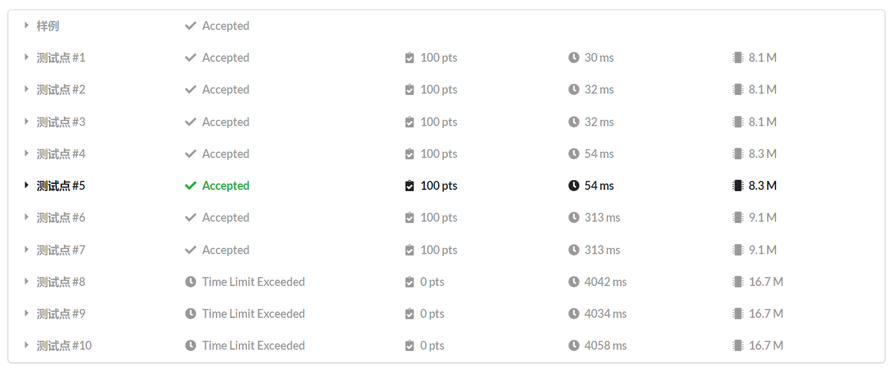
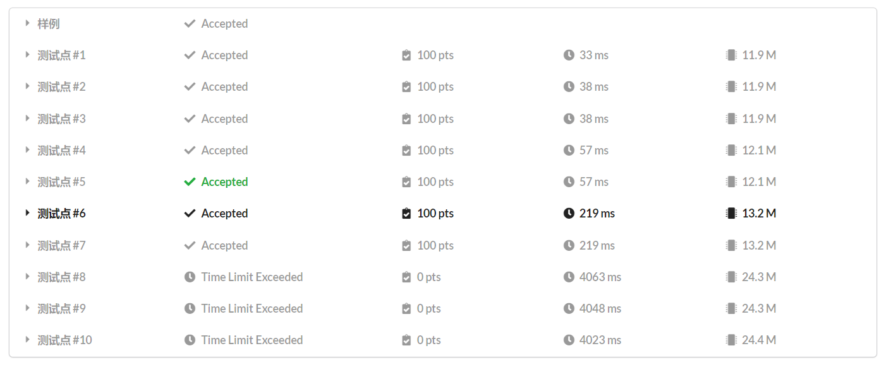

## 前置知识

[字符串基础 ](https://oi-wiki.org/string/basic/)  
[倍增](https://oi-wiki.org/basic/binary-lifting/)  
[基数排序](https://oi-wiki.org/basic/radix-sort/)  
[计数排序](https://oi-wiki.org/basic/counting-sort/)

## 一些约定

1. 字符串下标从 $1$ 开始
2. 字符串 $t$​ 长度为 $len(t)$​。特别的，字符串 $s$​ 长度为 $n$​
3. 本文中假设字符串只包含 **小写字母**
4. $s[l..r]$​ 表示 $s_ls_{l+1}\ldots s_r$​
5. **后缀 $i$​** 表示 $s[i..n]$​
6. **排名 $i$​ 后缀** 表示所有后缀中字典序排名为 $i$​ 的那个的开始位置

## 后缀数组

### 什么是后缀数组

~~后缀数组，顾名思义，就是存了后缀的数组~~。

其实后缀数组就是把所有后缀放在一起，然后按字典序排序。

盗一张 OI Wiki 的图。


### 后缀数组求法

求后缀数组的方法很多，比如说 $O(n^2 \log n)$​ 暴力，或者 $O(n \log^2 n)$​ 哈希，还有两种 $O(n)$​​​​​​ 做法（[SA-IS](https://riteme.site/blog/2016-6-19/sais.html)，[DC3](https://wenku.baidu.com/view/5b886b1ea76e58fafab00374.html)，链接来自 OI Wiki 推荐），以及本文要讲的 **倍增算法**。

### 算法思想

暴力的想法是，首先我们比较每个后缀 $i$​​ 的第 $1$​​ 个字符，然后比较第 $2$​​ 个，然后第 $3$ 个……一直到第 $n$ 个。但这样是 $O(n^2)$​​ 的。 

那怎么优化它呢？别忘了我们的算法叫倍增啊！当我们对一个后缀 $i$ 的前 $w$ 位排完序时，后缀 $i$ 的后面 $w$ 位的顺序我们也是知道的！这时我们只需要对于后缀 $i$ 中前 $w$ 位的排名和后缀 $i$ 中 $[w + 1 .. 2w]$ 位的排名进行双关键字排序，就可以得到后缀 $i$ 中前 $2w$ 位的排名啦！

~~再盗一张 OI Wiki 的图~~


### 具体实现

> 如果不想看 TLE 代码，可以直接移步到 [优化实现](#优化实现)，前面的内容是为优化实现作铺垫的。

#### 变量约定

- `sa[i]` — 排名 $i$ 后缀的开始位置
- `rk[i]` — 后缀 $i$ 的排名
- `tp[i]` — 即 temp，辅助数组，具体意思下面会说
- `p` — 辅助变量，具体意思下面会说

#### sort 实现

现在我们可以写出代码啦！每次暴力更新第一、二关键字，用 sort 排序就好啦！



代码来自 OI Wiki，变量大致是一样的（~~其实是我懒~~）

```cpp
#include <algorithm>
#include <cstdio>
#include <cstring>
#include <iostream>

using namespace std;

const int N = 1000010;

char s[N];
int n, w, sa[N], rk[N << 1], oldrk[N << 1];
// 为了防止访问 rk[i+w] 导致数组越界，开两倍数组。
// 当然也可以在访问前判断是否越界，但直接开两倍数组方便一些。

int main() {
  int i, p;

  scanf("%s", s + 1);
  n = strlen(s + 1);
  for (i = 1; i <= n; ++i) sa[i] = i, rk[i] = s[i];

  for (w = 1; w < n; w <<= 1) {
    sort(sa + 1, sa + n + 1, [](int x, int y) {
      return rk[x] == rk[y] ? rk[x + w] < rk[y + w] : rk[x] < rk[y];
    });  // 这里用到了 lambda
    memcpy(oldrk, rk, sizeof(rk));
    // 由于计算 rk 的时候原来的 rk 会被覆盖，要先复制一份
    for (p = 0, i = 1; i <= n; ++i) {
      if (oldrk[sa[i]] == oldrk[sa[i - 1]] &&
          oldrk[sa[i] + w] == oldrk[sa[i - 1] + w]) {
        rk[sa[i]] = p;
      } else {
        rk[sa[i]] = ++p;
      }  // 若两个子串相同，它们对应的 rk 也需要相同，所以要去重
    }
  }

  for (i = 1; i <= n; ++i) printf("%d ", sa[i]);

  return 0;
}
```



这样我们就可以 AC 了！



~~好打脸！~~

算啦，常数才不是我们要管的事，加 O2 不就能过了。  
但是！这样算法不就成 $O(n \log^2 n)$ 的了？我们的 ~~优秀~~ 算法怎么能允许这样的事出现？

#### 基数排序实现

要让算法的复杂度为 $O(n \log n)$，就要在排序上下功夫。  
双关键字排序，我们可以用基数排序（其中稳定排序使用计数排序）！  
于是，排序复杂度降为 $O(n \log n)$​。



~~再次盗用 OI Wiki 的代码~~

```cpp
#include <algorithm>
#include <cstdio>
#include <cstring>
#include <iostream>

using namespace std;

const int N = 1000010;

char s[N];
int n, sa[N], rk[N << 1], oldrk[N << 1], id[N], cnt[N];

int main() {
  int i, m, p, w;

  scanf("%s", s + 1);
  n = strlen(s + 1);
  m = max(n, 300);
  for (i = 1; i <= n; ++i) ++cnt[rk[i] = s[i]];
  for (i = 1; i <= m; ++i) cnt[i] += cnt[i - 1];
  for (i = n; i >= 1; --i) sa[cnt[rk[i]]--] = i;

  for (w = 1; w < n; w <<= 1) {
    memset(cnt, 0, sizeof(cnt));
    for (i = 1; i <= n; ++i) id[i] = sa[i];
    for (i = 1; i <= n; ++i) ++cnt[rk[id[i] + w]];
    for (i = 1; i <= m; ++i) cnt[i] += cnt[i - 1];
    for (i = n; i >= 1; --i) sa[cnt[rk[id[i] + w]]--] = id[i];
    memset(cnt, 0, sizeof(cnt));
    for (i = 1; i <= n; ++i) id[i] = sa[i];
    for (i = 1; i <= n; ++i) ++cnt[rk[id[i]]];
    for (i = 1; i <= m; ++i) cnt[i] += cnt[i - 1];
    for (i = n; i >= 1; --i) sa[cnt[rk[id[i]]]--] = id[i];
    memcpy(oldrk, rk, sizeof(rk));
    for (p = 0, i = 1; i <= n; ++i) {
      if (oldrk[sa[i]] == oldrk[sa[i - 1]] &&
          oldrk[sa[i] + w] == oldrk[sa[i - 1] + w]) {
        rk[sa[i]] = p;
      } else {
        rk[sa[i]] = ++p;
      }
    }
  }

  for (i = 1; i <= n; ++i) printf("%d ", sa[i]);

  return 0;
}
```



这下终于可以 AC 了。



~~打脸第二次~~

为什么！明明复杂度是正确的！  
但是，这份代码的常数确实太大了。

#### 优化实现

其实，基数排序中第二关键字可以不用计数排序，而是直接在存入时就排好序。

这里用我的代码详细讲解。（~~终于不是 OI Wiki 了~~）

```cpp
// main code
const int N = 1e6 + 5;

char s[N];
int n, m;

// sa 和 rk 开两倍的原因是有可能访问越界，当然也可以判越界
// tot 用于计数排序
int sa[N << 1], rk[N << 1], tot[N], tp[N];
void Sort() { // 计数排序并处理出 sa
	for(int j = 0; j <= m; j++) tot[j] = 0; // 桶清零
	for(int j = 1; j <= n; j++) tot[rk[j]]++;
	for(int j = 0; j <= m; j++) tot[j] += tot[j - 1]; // 计数排序套路
	for(int j = n; j >= 1; j--) sa[tot[rk[tp[j]]]--] = tp[j];
}
void SA() {
	m = 'z';
	for(int j = 1; j <= n; j++) rk[j] = s[j], tp[j] = j;
	Sort(); // 由于下面不会用到 rk，所以不用处理 rk，当然处理了也没错
	for(int i = 1, p = 0; p < n; i <<= 1, m = p) { // i 即上文的 w
		p = 0;
		for(int j = 1; j <= i; j++) tp[++p] = n - i + j;
		for(int j = 1; j <= n; j++) if(sa[j] > i) tp[++p] = sa[j] - i;
		Sort();
		for(int j = 1; j <= n; j++) tp[j] = rk[j]; // 由于 tp 不会再用到，我们用 tp 来表示上一轮的 rk
		rk[sa[1]] = p = 1;
		for(int j = 2; j <= n; j++)
			rk[sa[j]] = ((tp[sa[j - 1]] == tp[sa[j]] && tp[sa[j - 1] + i] == tp[sa[j] + i]) ? p : ++p);
	}
}
```

这一部分比较复杂，下面是详细讲解。

##### 第一部分

```cpp
// Code 1.1 (main code, Line 10~25)
void Sort() { // 计数排序并处理出 sa
	for(int j = 0; j <= m; j++) tot[j] = 0; // 桶清零
	for(int j = 1; j <= n; j++) tot[rk[j]]++;
	for(int j = 0; j <= m; j++) tot[j] += tot[j - 1]; // 计数排序套路
	for(int j = n; j >= 1; j--) sa[tot[rk[tp[j]]]--] = tp[j];
}
```

首先来看计数排序。计数排序的这里的作用是对第一关键字作稳定排序。下面分句看。

```cpp
for(int j = 1; j <= n; j++) tot[rk[j]]++; // Code 1.1, Line 4
```

这里将所有的后缀 $i$ 的排名记录到桶里。注意此时 `rk` 有可能相同，但排到最后肯定是不同的（因为长度都不同）。

```cpp
for(int j = n; j >= 1; j--) sa[tot[rk[tp[j]]]--] = tp[j]; // Code 1.1, Line 6
```

这里更新 `sa`，先说一下此时每个数组的意思。

- `tp[i]` — 第二关键字排名为 $i$ 的后缀的开始位置（至于为什么不直接记录后缀 $i$ 的第二关键字，到后面就懂了）
- `rk[i]` — 上一轮排完后后缀 $i$ 的排名，此处是后缀 $i$ 的第一关键字。

那么这句话就是枚举 **第二关键字的排名** $j$，那么 `tp[j]` 就是当前枚举的（第二关键字排名为 $j$ 的）字符串的开头，又因为 `sa[i]` 表示排名 $i$ 后缀的开头，所以这句话就是说：  
将当前枚举字符串的 `tot` 作为这个字符串的排名，并将 `tot` 自减（`tot` 自减是计数排序的套路）。

注意到需要的是稳定排序，所以枚举是倒序的。

##### 第二部分

```cpp
// Code 1.2 (main code, Line 20)
for(int i = 1, p = 0; p < n; i <<= 1, m = p) // i 即上文的 w
```

这里的 $p$ 指的是已经排出的不同后缀的个数。

##### 第三部分

```cpp
// Code 1.3 (main code, Line 21~23)
p = 0;
for(int j = 1; j <= i; j++) tp[++p] = n - i + j;
for(int j = 1; j <= n; j++) if(sa[j] > i) tp[++p] = sa[j] - i;
```

这一部分是对第二关键字进行排序，也就是更新 `tp`。  
这里 `sa` 就是原来的意思，`tp` 还是表示第二关键字排名为 $i$ 的后缀的开始位置。

```cpp
for(int j = 1; j <= i; j++) tp[++p] = n - i + j; // Code 1.3, Line 3
```

这里是将后缀 $n - i + 1 .. n$ 进行排序，对于这些后缀，它们是没有第 $i + 1 .. 2i$ 位的，所以要单独处理。  
当然，对于这部分，长度越小排名越前。

```cpp
for(int j = 1; j <= n; j++) if(sa[j] > i) tp[++p] = sa[j] - i; // Code 1.3, Line 4
```

这一部分是对那些剩下的后缀（即后缀 $1 .. n - i$）排序，这里可以理解为我们在枚举 `sa[j]`，即按第一次的排名枚举后缀。实际上，我们枚举的是剩下后缀的第 $i+1$ 位，即第二关键字开始的位。所以这里就是说：  
按上次的排名枚举后缀 $j$​，并将后缀 $j - i$ 作为第 $p$ 小的字符串，并将 $p$​ 自增。​

##### 第四部分

```cpp
// Code 1.4 (main code, Line 26~28)
rk[sa[1]] = p = 1;
for(int j = 2; j <= n; j++)
    rk[sa[j]] = ((tp[sa[j - 1]] == tp[sa[j]] && tp[sa[j - 1] + i] == tp[sa[j] + i]) ? p : ++p);
```

这里是对 $rk$​ 进行更新。此时各个数组的意义：

- `rk[i]` — 这一轮后缀 $i$ 的排名
- `sa[i]` — 这一轮排名 $i$ 后缀开始的位置
- `tp[i]` — 上一轮后缀 $i$ 的排名
- $p$ — 已经排出的不同排名个

这一部分就一起解释吧。

第 2 行将排名 $1$ 后缀的排名和 $p$ 置为 $1$。（其实此时 $p$ 还是计数器，不过计数完了就成了不同排名个数）  
然后比较相邻两个字符串（用上一轮的 $rk$ 进行比较），不同将排名个数 $p$ 加一。

#### 压行实现

不讲。



```cpp
const int N = 1e6 + 5;

char s[N];
int n, m;

int sa[N << 1], rk[N << 1], tot[N], tp[N];
void calcSA() {
	m = 'z';
	for(int i = 0, p = 0; p < n; i = (i ? i << 1 : 1), m = p) {
		if(i) {
			p = 0;
			for(int j = 1; j <= i; j++) tp[++p] = n - i + j;
			for(int j = 1; j <= n; j++) if(sa[j] > i) tp[++p] = sa[j] - i;
		} else for(int j = 1; j <= n; j++) rk[j] = s[j], tp[j] = j;
		for(int j = 0; j <= m; j++) tot[j] = 0;
		for(int j = 1; j <= n; j++) tot[rk[j]]++;
		for(int j = 0; j <= m; j++) tot[j] += tot[j - 1];
		for(int j = n; j >= 1; j--) sa[tot[rk[tp[j]]]--] = tp[j];
		if(!i) continue;
		for(int j = 1; j <= n; j++) tp[j] = rk[j];
		rk[sa[1]] = p = 1;
		for(int j = 2; j <= n; j++)
			rk[sa[j]] = ((tp[sa[j - 1]] == tp[sa[j]] && tp[sa[j - 1] + i] == tp[sa[j] + i]) ? p : ++p);
	}
}
```



## height 数组

### 定义

#### LCP 定义

$lcp(s, t)$ 表示字符串 $s$ 和 $t$ 的最长公共前缀，也即最大的 $i$ 满足 $s[1..i]=t[1..i]$​。

### height 数组定义

$height[i] = lcp(sa[i], sa[i - 1])$​，即 $height[i]$ 表示排名 $i$ 和 $i - 1$ 后缀的 LCP。

### 引理

引理：$height[rk[i]] \ge height[rk[i - 1]] - 1$，即**后缀 $i$​ 和排名前一位的后缀的LCP** 不小于 **后缀 $i$​ 排名前一位的和前两位的LCP** $-1$。

证明：（~~我不会证~~我懒，所以找了 OI Wiki 的证明 ~~怎么又是 OI Wiki~~）


### 代码实现

```cpp
void get_height() { // ht[] 就是 height
    for(int i = 1, k = 0; i <= n; i++) {
        if(rk[i] == 1) { ht[rk[i]] = 0; continue; }
        if(k) k--;
        int j = sa[rk[i] - 1];
        while(i + k <= n && j + k <= n && s[i + k] == s[j + k]) k++;
        ht[rk[i]] = k;
    }
}
```

## 参考资料

[OI Wiki](https://oi-wiki.org/string/sa/)

